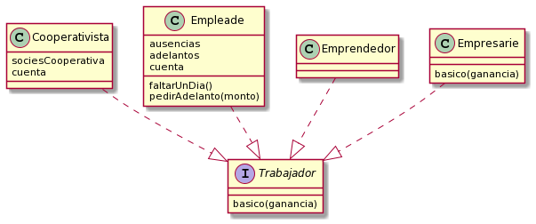
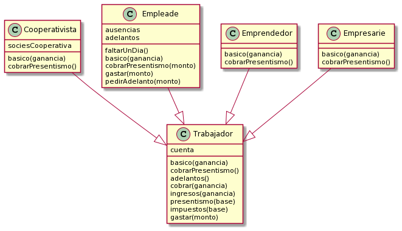

# Trabajadorxs

Más o menos a principio de mes, todas las personas con la suerte de tener un trabajo cobran un ingreso de dinero a su cuenta. Cuando una persona cobra, incorpora a su cuenta:

**BÁSICO + PRESENTISMO - IMPUESTOS - ADELANTOS**
El detalle del cálculo, no es igual para todo el mundo, como bien sabemos.

El básico se calcula así:
* **Cooperativista:** divide la ganancia en partes iguales según la cantidad de miembros de la cooperativa (que es un dato que cualquier cooperativista conoce).
* **Empleade:** se queda con el 1% de la ganancia que generó (pues la plusvalía va para les empresaries).
* **Emprendedor/a:** se queda con 5000 pesos, no importa cuánta ganancia genere. 
* **Empresarie:** se queda con el 80% de la ganancia que se generó.

Cooperativistas y emprendedores no cobran nunca **presentismo**. Les empleades, sólo lo cobran si faltaron cero veces. Les empresaries lo cobran siempre. El presentismo es una doceava parte del básico.

Los **impuestos** son para todo el mundo del 5% del básico de ese mes.

Además, cada una de estas personas **gastan dinero**. Cuando gastan un monto, todes notifican cuando se van a quedar sin dinero en la cuenta impidiendo que se produzca el gasto que los dejaría en esa situación. En el caso de empleades, además, si luego del gasto les quedan menos de 500 pesos, piden un adelanto de 1000.

Se pide cumplir con los requerimientos mencionados para que cada persona pueda entender los siguientes mensajes:
1. persona.basico(ganancia)
2. persona.sueldoPara(ganancia)
3. persona.cobrarSueldo(ganancia)
4. persona.gastar(cantidad)

### Diagrama de clases Base

### Diagrama de clases Final

